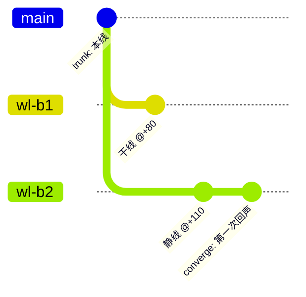

<div align="center">

# Worldbuilding Architect · 世界观建筑师

> *「别再让 AI 吐出一座塑料布景。让历史自己长出来、名字带着来历、地图分立场、时间能分叉又收束。」*

[](SKILL.md)
[](https://skills.sh/silveriverside/worldbuilding-architect)
[](.claude-plugin/marketplace.json)
[](LICENSE)

**把"写世界观"从一次性灵感倾倒，变成一座按真实历史逻辑、逐次决策生长、永不自相矛盾的活体文本档案库。**

[看效果](#效果示例真实产物锚地) · [安装](#快速开始) · [触发方式](#触发方式) · [它和同类有什么不同](#它和同类有什么不同) · [安全边界](#安全边界)

</div>

---

```
WL-α (本线/home) ──┬── WL-β1  (韦氏裁决判"副本非人") ── 上传被禁、港务靠义体修复夺权
                   └── WL-β2  (港务把回声证据多压了 22 年) ──┐
                                                          └── 在「第一次回声」处向 α 收束
```
<sub>↑ 出自示例世界《锚地 Anchorage》的世界线树：三条线以「对主干的 diff」撰写，最终都撞上同一个不动点。完整 codex 见 <a href="examples/anchorage/">examples/anchorage/</a>。</sub>

---

## 它解决什么问题

你让 AI "帮我写个世界观"，十有八九拿回一堆**塑料布景**：名字像随机生成器吐的（"奇点水晶""量子枢纽"）、历史是"然后帝国就崩溃了"的颁布式流水账、派系是贴了标签的队伍（生态派 / 科技派 / 宗教派）、地图是一张上帝视角的中立平面图。看着挺满，一推就倒——因为它没有**来历**。

真实的世界不是这样长的。真实里：一个名字是它诞生那一刻和那群人的化石；一场剧变是无数小压力（一笔税、一次寒潮、一批有缺陷的义肢固件）累积到临界点的突变；一个派系是历次背叛与妥协结成的疤；同一片空间，住在里面的东西和路过的人会给它起完全相反的名字。

**Worldbuilding Architect** 把这套"让世界活起来"的手艺编码成八条纪律和一套可生长的文件系统。它不替你拍脑袋，而是逼着每一个名字、每一段历史、每一张地图都回答一句"**为什么是这样**"，并把答案落进一个交叉引用、永不自相矛盾、可以一直长下去的 codex。

## 效果示例（真实产物·锚地）

下面全部出自用本 skill 跑出来的示例世界 [《锚地 Anchorage》](examples/anchorage/)——一个"太空电梯 + 意识备份 + 轨道尘带里的异生命"的科幻设定。

**① 名字有来历**（不是生成器吐的，每个都能一句话说清"谁、为何这么叫"）

| 词 | 来历机制 | 取自 / 为何 |
|---|---|---|
| 系链 the Tether | 类比 / 旧词沿用 | 工程图上"把货船系在天上的缆"，名字一直没改过来 |
| 丙七 Cohort-Seven | 编号逃逸出厂 | 补贴义肢的批次号；召回惨案后引申为"被廉价零件害死" |
| 搁架众 the Shelved | 委婉语→蔑称→自称 | 本是"被强制封存意识"的蔑称，被该派接纳为旗号（如同"布尔什维克"本只是"多数"）|

**② 历史是涌现的**（"暗流 → 触发 → 级联 → 新常态"四拍，而非"然后就崩溃了"）

> **+31 年** —— *触发（很小）*：一名稽查员例行抽查，签发了对**丙七批次**固件的合规放行——而这批固件有个低温下才发作的同步缺陷。地早就被泡透了，这一签只是最后一滴水。
> **+33 年** —— **丙七召回**（*级联*）：一次寒潮里数千具义肢同时锁死。劳工暴动 → 港务公信力崩塌 → "身体到底归谁"从街头口角变成立法危机。
> **+34 年** —— *新常态*：第一部《义体人身法》草案诞生，备份技术从地下走到台前。时代翻篇。

**③ 地图是一种视角**（图底翻转：同一片空间，人类叫"渣带"，住在里面的把它当"海"）

> 环绕行星的尘埃带，对人类是升降舱必须穿过的**垃圾场（"渣带"）**；对漂浮其间的异生命却是可以一生畅游的**海洋**——而人类的母行星，在它们看来不过是海里**又一座普通的漂浮"空岛"**。第一次回声破译它们的"语言"后，官方文书被迫把"渣带"改成"星尘之海"——*一次因新知识而起的改名*。

## 快速开始

```bash
npx skills add silveriverside/worldbuilding-architect
```

装完，对你的 Agent 说：

```text
用 worldbuilding-architect 帮我起一个世界观：硬科幻，核心问题是"当记忆可以买卖，谁还拥有自己的过去"。先给我时代主轴和两个对立派系。
```

也支持作为 Claude Code 插件安装（marketplace 双通道）：

```text
/plugin marketplace add silveriverside/worldbuilding-architect
/plugin install worldbuilding-architect@worldbuilding-architect
```

## 触发方式

- "帮我设计一个世界观 / 设定集 / lore bible"
- "写一个赛博朋克 / 太空歌剧 / 末世的世界设定"
- "给我的小说 / 游戏 / 剧本建一套自洽的背景史"
- "扩展我已有的世界观，加一个派系 / 一个时代"
- "这个世界需要时间旅行 / 平行世界线 / 周目 / 世界线收束，帮我把因果规则定下来"
- "给我的世界起一批有来历的名字"
- "帮我把这片大陆的地理按不同文化的视角重命名"

## 它会交付什么

| 能力 | 交付物 |
|---|---|
| 起一个新世界 | 一座脚手架好的 codex 文件夹：总览、时代主轴、2-3 个派系、地理、命名词典、暗流表 |
| 扩展已有世界 | 在正确的文件里新增内容，并同步更新索引、词典、交叉链接，检查不与既有事实矛盾 |
| 制造一次"质变" | 一场可追溯到微观成因的历史剧变，并改写所有受影响的文件（改地名、裂派系、造新词）|
| 多世界线 | 先锁定因果规则，再把每条平行线作为"对主干的 diff"撰写，附世界线树 |

产物是**纯文本 Markdown codex**（可直接进 Obsidian / git），整套样例见 [examples/anchorage/](examples/anchorage/) 的 24 个文件。

## 让结构看得见（自动生成的视图）

文本是唯一真相源，图表从它**自动派生、绝不手写**（手画的图迟早和正文失同步）。给时代 / 派系 / 角色 / 世界线加一小段机器可读的 front-matter 骨架，跑一条命令：

```bash
python scripts/build_views.py examples/anchorage --title "锚地 Anchorage"
```

一个源头、两种产物，按需取用，不绑定任何工具：

- **Mermaid 图**（`_views/views.md`）：世界线树用 `gitGraph`——分支即分叉、汇合即**世界线收束**；时代主轴用 `timeline`；派系/人物用关系图。在 Obsidian 和多数 Markdown 阅读器里原生渲染。
- **单文件交互 HTML**（`_views/index.html`）：数据内联、零依赖，**双击即开**，可拖拽 / 缩放 / 点击查看详情，不需要服务器或 Obsidian。给不用 Obsidian 的人。
- **构建报告**（`_views/_build_report.md`）：画了什么，以及**哪些文件缺骨架没画进去**（列为待修项，不静默忽略）。

锚地的成品视图已入库：[examples/anchorage/_views/](examples/anchorage/_views/)。下面是它的世界线树（α 本线分叉出 β1 干线 / β2 静线，最终都向「第一次回声」收束）：



## 它和同类有什么不同

| 维度 | 常见做法（模板填空 / 一致性检查类） | Worldbuilding Architect |
|---|---|---|
| 历史 | "列出主要历史事件" | **涌现式**：暗流→触发→级联→新常态，可追溯到微观成因 |
| 命名 | "起一些好听的名字" | **命名考据学**：八种来历机制，每个词登记到词典，绝不凭空造 |
| 派系 | "定义阵营及其特征" | **历史沉积**：先建事件再让派系"剩下来"，内部自带不相容的裂缝 |
| 地理 | "画一张地图，标注地点" | **视角地理**：同一地点按文化 / 时代有不同名字，随权力更替而改名 |
| 时间线 | （通常不支持）| **diff 式多世界线**：固定因果规则、分支 / 收束 / 周目 / 超时空通讯 |
| 形态 | 一次性输出 | **持久 codex**：交叉引用、可无限生长、每次改动留 CHANGELOG |

> 不攻击同行——很多模板型 skill 在"快速起步"上更轻。本 skill 的取向是**深度与自洽**：让世界经得起反复查阅和续写。

## 安全边界

- **只写文本，不删你的东西。** 脚手架脚本 `init_codex.py` 对已存在的文件一律跳过、绝不覆盖。
- **改动既有设定前先读后写。** 扩展模式下会先读总览 / 时代索引 / 词典 / 暗流，确认不与既有事实（日期、谁已死、什么技术还不存在）矛盾；若必须 retcon，记进 CHANGELOG。
- **多世界线机器按需才装。** 单时间线世界完全忽略 `10-` / `11-`；只有world确实涉及时间旅行 / 分支 / 循环时才脚手架它们，且先定因果规则。
- **不臆造既有事实。** 新名字必须遵循该文化已确立的命名逻辑，不破坏已登记词条。

## 文件结构

```
worldbuilding-architect/
├── SKILL.md                 # 主入口：八条核心哲学 + founding/expanding 工作流
├── references/              # 八篇可执行方法论（按当前任务读对应一篇）
│   ├── emergent-history.md      # 让历史显得有因果、累积、会质变
│   ├── naming-provenance.md     # 八种来历机制，给名字考据学
│   ├── factions-from-history.md # 把派系当历史沉积来建
│   ├── perspective-geography.md # POV 相对、随时代改名的地理
│   ├── storylines-and-paths.md  # 明 / 暗 / 支线交织；多发展方向
│   ├── scifi-toolkit.md         # 让重科幻元素落地（上传 / 义体 / 方舟…）
│   ├── deep-extrapolation.md    # "然后呢？"引擎：效应阶梯 + 利益相关者格阵
│   └── multi-worldline.md       # 时间旅行 / 分支 / 收束 / 周目 / 超时空通讯
├── assets/templates/        # 每类文件的模板（写新文件前先读对应模板）
├── scripts/
│   ├── init_codex.py        # 一键脚手架一座 codex（支持 --multiline）
│   ├── build_views.py       # 从 codex front-matter 自动生成视图（Mermaid + 交互 HTML）
│   └── viewbuild/           # 生成器模块（零依赖：解析 / Mermaid / HTML / 报告）
└── examples/anchorage/      # 真实产物示例：科幻世界《锚地》+ 自动生成的 _views/
```

## 验证与测试

脚手架脚本可直接试跑（不污染你的目录，写到指定路径）：

```bash
python3 scripts/init_codex.py "Test World" /tmp/wb-demo --multiline
```

合格表现：在 `/tmp/wb-demo/worldbuilding/test-world/` 下生成 13 个文件（含 `01-timeline/`、`02-factions/` 等目录与索引、`10-timeline-mechanics.md`、`11-worldlines/_tree.md`），对已存在文件打印 `skip`。

方法论是否真的奏效，看 [examples/anchorage/](examples/anchorage/)：对照 `08-naming-lexicon.md`（每个词都有来历）、`01-timeline/era-01-the-tether-years.md`（四拍质变）、`04-geography/the-scour.md`（视角翻转）、`11-worldlines/_tree.md`（diff 式收束）即可验收。

## 致谢

方法论受多部作品的**结构**启发（学结构，不照搬设定）：《三体》的派系源于对同一事实的不同反应、宇宙社会学的"演练与警告"；《沙丘》的深层历史；Stellaris / Paradox 大战略的"脚本化主干 + 涌现式血肉"；《攻壳机动队》对身体与自我的法律化追问。打磨流程参考鲁班 Skill 工坊的 house-style 与出生证清单。

## License

[MIT](LICENSE)

---

<div align="center">

*起一个世界 → 让它长出历史 → 在它分叉处留一道回声。*

</div>
