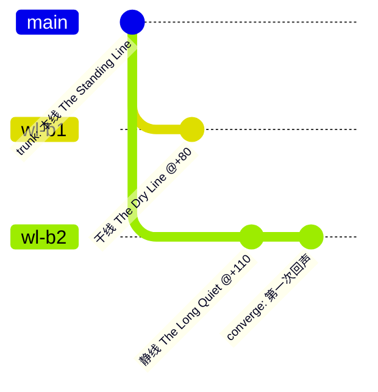
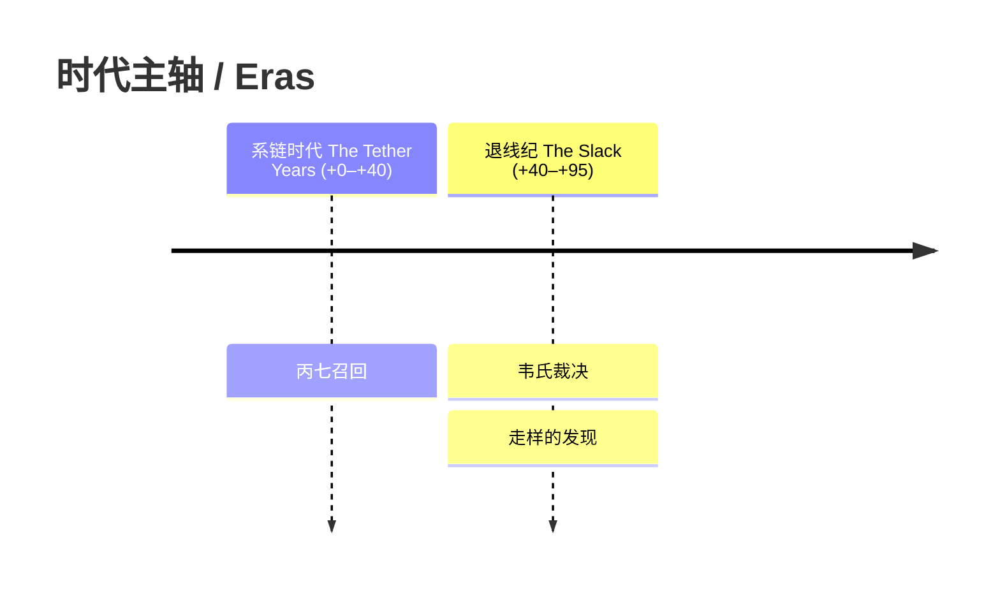
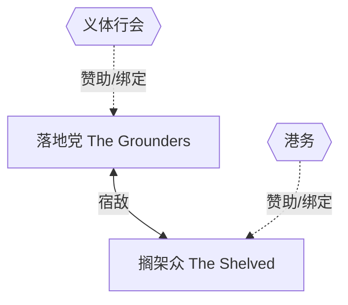
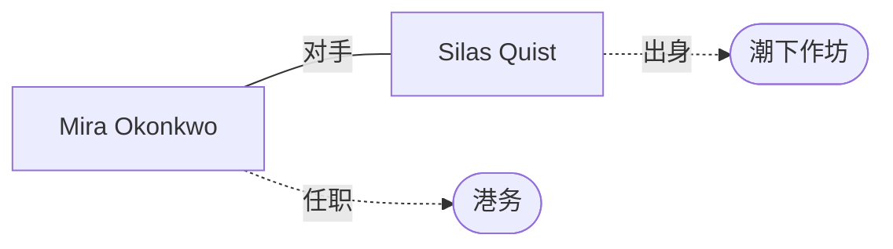

# Views — 自动生成，请勿手改

> 本文件由 `scripts/build_views.py` 从 codex 的 front-matter 自动生成。
> 唯一真相源是各 .md 正文；改世界观后重跑脚本即可同步。

## 世界线树 / Worldline tree

## 时代主轴 / Timeline

## 派系关系 / Factions

## 人物关系 / Characters

